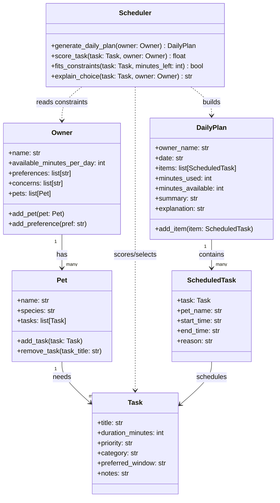

# PawPal+ Project Reflection

## 1. System Design

**a. Initial design**

- Briefly describe your initial UML design.
- What classes did you include, and what responsibilities did you assign to each?

**
- Owner
  - Attributes: name, pets
  - Actions: see user info, edit user info, see pet(s), add/remove/edit pet(s), view daily schedule, generate daily schedule
- Pet
  - Attributes: name, owners, tasks
  - Actions: see pet info, edit pet info, see owner(s), add/remove/edit owner(s), see tasks for this pet, add/remove/edit tasks for this pet
- Task
  - Attributes: name, associated pet(s), start time, end time, priority, user notes
  - Actions: view info, edit associated info
- Schedule (maybe optional, unsure if we can just use a list of tasks)
  - Attributes: tasks, explanation/description
  - Actions: view all tasks, edit tasks, edit order
**

This is a very rough draft.

**b. Design changes**

- Did your design change during implementation?
- If yes, describe at least one change and why you made it.

Yes. I refined the draft so it maps more directly to the README requirements (daily scheduling, constraints, and explainability):

- Kept `Owner`, `Pet`, and `Task`, but narrowed responsibilities so data classes store information and a dedicated planner class handles scheduling logic.
- Replaced the optional `Schedule` idea with two concrete classes:
  - `DailyPlan`: stores selected scheduled tasks + summary + explanation.
  - `ScheduledTask`: stores a task plus computed start/end times and reason chosen.
- Added `Scheduler` as the decision-making class. This class evaluates constraints (available minutes, priority, owner preferences/concerns, preferred time windows) and generates one plan across all pets for the owner.
- Removed many CRUD-style actions from UML methods (like “see/edit” for every field) and focused methods on behavior the project actually needs: adding tasks/pets, generating a plan, and explaining tradeoffs.

---

## 2. Scheduling Logic and Tradeoffs

**a. Constraints and priorities**

- What constraints does your scheduler consider (for example: time, priority, preferences)?
- How did you decide which constraints mattered most?

**b. Tradeoffs**

- Describe one tradeoff your scheduler makes.
- Why is that tradeoff reasonable for this scenario?

---

## 3. AI Collaboration

**a. How you used AI**

- How did you use AI tools during this project (for example: design brainstorming, debugging, refactoring)?
- What kinds of prompts or questions were most helpful?

**b. Judgment and verification**

- Describe one moment where you did not accept an AI suggestion as-is.
- How did you evaluate or verify what the AI suggested?

---

## 4. Testing and Verification

**a. What you tested**

- What behaviors did you test?
- Why were these tests important?

**b. Confidence**

- How confident are you that your scheduler works correctly?
- What edge cases would you test next if you had more time?

---

## 5. Reflection

**a. What went well**

- What part of this project are you most satisfied with?

**b. What you would improve**

- If you had another iteration, what would you improve or redesign?

**c. Key takeaway**

- What is one important thing you learned about designing systems or working with AI on this project?
