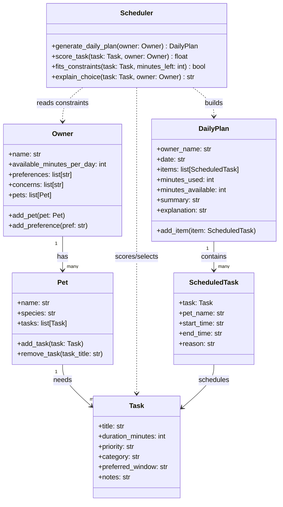
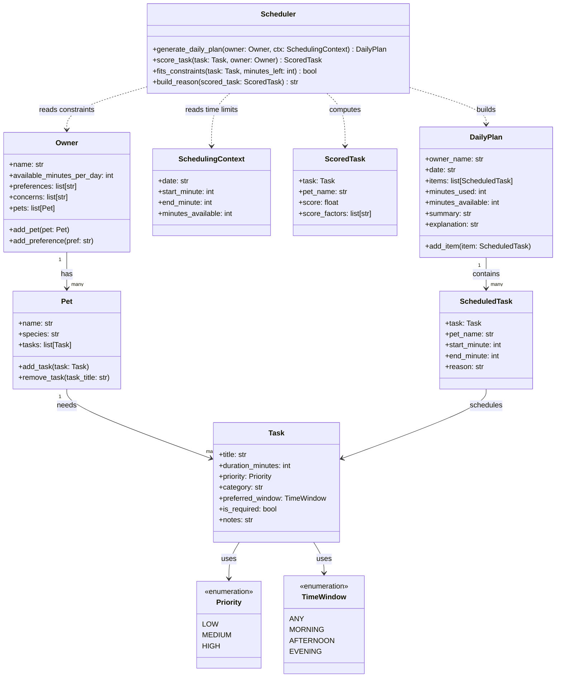
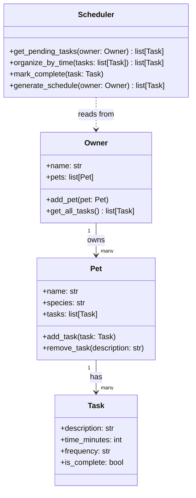
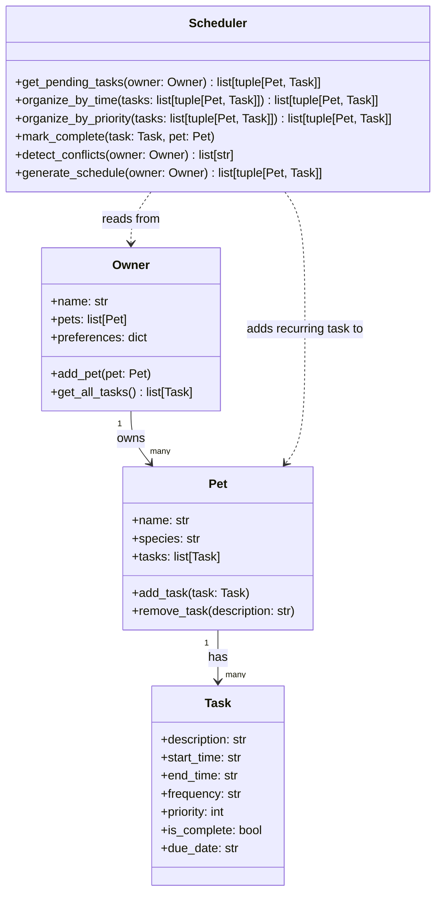

# PawPal+ Project Reflection

## 1. System Design

**a. Initial design**

- Briefly describe your initial UML design.
- What classes did you include, and what responsibilities did you assign to each?

- Owner
  - Attributes: name, pets
  - Actions: see user info, edit user info, see pet(s), add/remove/edit pet(s), view daily schedule, generate daily schedule
- Pet
  - Attributes: name, owners, tasks
  - Actions: see pet info, edit pet info, see owner(s), add/remove/edit owner(s), see tasks for this pet, add/remove/edit tasks for this pet
- Task
  - Attributes: name, associated pet(s), start time, end time, priority, user notes
  - Actions: view info, edit associated info
- Schedule (maybe optional, unsure if we can just use a list of tasks)
  - Attributes: tasks, explanation/description
  - Actions: view all tasks, edit tasks, edit order

This is a very rough draft.

**b. Design changes**

- Did your design change during implementation?
- If yes, describe at least one change and why you made it.

Yes. I refined the draft so it maps more directly to the README requirements (daily scheduling, constraints, and explainability):

- Kept `Owner`, `Pet`, and `Task`, but narrowed responsibilities so data classes store information and a dedicated planner class handles scheduling logic.
- Replaced the optional `Schedule` idea with two concrete classes:
  - `DailyPlan`: stores selected scheduled tasks + summary + explanation.
  - `ScheduledTask`: stores a task plus computed start/end times and reason chosen.
- Added `Scheduler` as the decision-making class. This class evaluates constraints (available minutes, priority, owner preferences/concerns, preferred time windows) and generates one plan across all pets for the owner.
- Removed many CRUD-style actions from UML methods (like “see/edit” for every field) and focused methods on behavior the project actually needs: adding tasks/pets, generating a plan, and explaining tradeoffs.

To reduce implementation risk before coding, I made a few optimization-oriented refinements for readability, consistency, and scheduler stability:

- **Data consistency:** Replace free-form strings (like priority and time window) with controlled values (enum-like constants) to prevent invalid inputs.
- **Scheduling reliability:** Add deterministic tie-breakers when two tasks score equally, so schedules are reproducible and easier to test.
- **Constraint clarity:** Mark tasks as required vs optional so must-do care (for example meds/feeding) is protected when time is limited.
- **Separation of concerns:** Keep scheduler orchestration separate from score-factor tracking so explanations do not recompute logic.
- **Time representation:** Use minutes-from-midnight internally and format to readable clock strings only for display.

### Simplified Design (4-Class Version)

### Final Design (Matches Implementation)

**Final design choices:**

- **Task** is a plain data container — no logic, just the facts about one activity (what it is, how long, how often, done or not).
- **Pet** owns its tasks directly. This keeps pet-specific data together and makes it easy to add or remove tasks per pet.
- **Owner** is the single entry point for the rest of the system. `get_all_tasks()` flattens tasks across all pets so the Scheduler doesn't need to know about the Owner → Pet → Task chain itself.
- **Scheduler** is the only class with real logic. It depends on Owner (via a dashed arrow) but doesn't store any state — it just reads, organizes, and returns. This keeps it easy to swap out or test independently.
- The original 6-class design added `SchedulingContext`, `ScoredTask`, `ScheduledTask`, `DailyPlan`, and two enums. Those are useful if you need time-window scoring or a printable daily plan, but for a minimal working scheduler they're unnecessary complexity.

---

## 2. Scheduling Logic and Tradeoffs

**a. Constraints and priorities**

- What constraints does your scheduler consider (for example: time, priority, preferences)?
- How did you decide which constraints mattered most?

Time, priority, and preferences are all considered in the scheduling the algorithm. The user can specify whether to sort by start time or priority within the UI, and the scheduler will follow the user's preferences.

**b. Tradeoffs**

- Describe one tradeoff your scheduler makes.
- Why is that tradeoff reasonable for this scenario?

---

The conflict detection implementation is currently a quadratic algorithm rather than logarithmic, but this is necessary in order to capture non-adjacent overlaps (e.g. if task A spans tasks B and C). Libraries like `intervaltree` may also be considered if a logarithmic time complexity is needed.

## 3. AI Collaboration

**a. How you used AI**

- How did you use AI tools during this project (for example: design brainstorming, debugging, refactoring)?
- What kinds of prompts or questions were most helpful?

**b. Judgment and verification**

- Describe one moment where you did not accept an AI suggestion as-is.
- How did you evaluate or verify what the AI suggested?

---

I used AI (Claude) in all phases of this project, but mainly for refactoring and design brainstorming. I found that it was very helpful for refining my mermaid diagrams to be more modular. The prompts that were most helpful were one-shot and few-shot prompts (basically any instances where I provided an example alongside my prompt). I also used AI to correctly format my README.

One suggestion Claude offered that I did not accept was a UML diagram that initially contained six classes and included separate classes for regular and scheduled tasks. After realizing that the rest of the project hinged on having only four classes and identifying redundancies in the current layout, I asked Claude to revise my diagram to only contain four classes.

## 4. Testing and Verification

**a. What you tested**

The suite covers 31 tests across six areas: task defaults, pet management, owner aggregation, sorting correctness, recurrence logic, and conflict detection. These were the most important behaviors to test because they represent the core scheduling guarantees. If sorting, recurrence, or conflict detection are broken, the app produces incorrect or misleading output for the user.

**b. Confidence**

★★★★☆ (4/5). The scheduling logic layer is fully tested and all 31 tests pass. Confidence is high for sorting, recurrence, and conflict detection. The main gap is the Streamlit UI (`app.py`), which has no automated tests. Edge cases like rapid checkbox clicks or duplicate key collisions can only be caught through manual testing.

---

## 5. Reflection

**a. What went well**

- What part of this project are you most satisfied with?

I am pleased with how well documented this project is, and it taught me a lot about iterative software development and comprehensive unit testing. The reasons behind the design choices here are explained in detail and easy to understand.

**b. What you would improve**

- If you had another iteration, what would you improve or redesign?

I would work on making the scheduling logic smarter by introducing other sorting criteria besides priority and start time. Sorting by end time or by pet (for example, if some pets need more continuous care than others) may be interesting.

**c. Key takeaway**

- What is one important thing you learned about designing systems or working with AI on this project?

I learned that even with AI, software development is an iterative process. All code written by AI must be evaluated and verified with corresponding unit tests to ensure it behaves as intended. AI is much more like a pair programmer than a tool for dramatically speeding up the engineering process.
